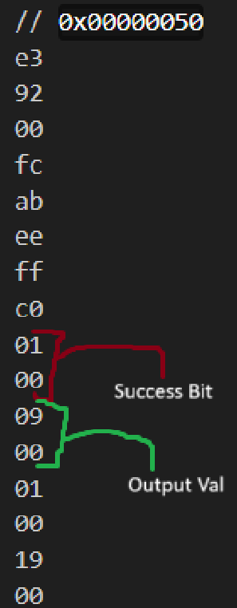

# Trust the Multiply Functionality

This test bench can be modified however you see fit.

The current implementation takes 28,703 cycles (without forwarding) to complete. Most of the time is
taken up by the manual adder, which constantly adds twice, and then branches.

Becuase of the variability, this is intended to be an advanced benchmark, but can be also used as a
basic benchmark.

## How To Edit This Program

This program can be edited in two ways:

- Change x1 in regs_in.hex to be a larger or smaller
  - This changes the number of words in memory that you touch
- Change the memory after the instruction

``` assembly
AB
EE
FF
C0
```

- It is also redundantly labeled with:

``` assembly
//INSERT YOUR FIRST VALUE HERE (03 00 00 00 = 0x3)
```

- This will change the input values for every time the multiply algorithm is run.

## Debuggings

I have also included two extra folders for debugging purposes.



As shown in the image above, the added functionality of these tests just show you the lower 32 bits of the output of either:

- the manual adding loop
- the multiply instruction
