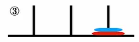

# Trust the Towers of Hanoi: Advanced Benchmark 2

## Running the benchmark

For the benchmark, please use mem_in_high_n and regs_in as your mem and reg in. There is nothing to verify; however, the benchmark
still has utility, by testing the raw speed of your ALU, branching, and memory accesses all in one. The number of disks is set to 
15, and the runtime should be around 11 minutes.

## More about the algorithm

Please familiarize yourself with the Towers of Hanoi problem: https://en.wikipedia.org/wiki/Tower_of_Hanoi

In this test, x1 is your n, or the number of disks in the Towers of Hanoi problem. There are three pillars, the source, 
target, and auxiliary pillar, known to you as tower 1, 3, and 2 respectively. These numbers are stored in x2-x4.
Do NOT change them.

## Recording moves in memory

The benchmark also has the capacity to record the actual "moves" that are made in the Towers of Hanoi problem. However, since we are
limited by 1KB of memory, any number of disks over 8 will overwrite the stack and mess things up. This is why mem_in_high_n and 
mem_in_low_n are necessary, since mem_in_high_n will not write the moves to memory. 

If you wish to see the moves in memory, please use mem_in_low_n and set x1 to a number less than 8, but greater than 1 (since any 
number of disks less than one doesn't make sense).

Each move is stored in memory as half words that can be easily read. These halfwords start at 0xb0, and look something like 0x0121,
or 0x0223. The way you read them is from left to right, for example:

0x0abc  --> disk a is moved from tower b to tower c.
0x0121 --> disk 1 is moved from tower 2 to tower 1.
0x0213 --> disk 2 is moved from tower 1 to tower 3.

For example, if you were to set n to 2, this is the starting state, with 2 disks on tower 1:

The first move is 0x0112:

Next 0x0213:

   

And finally 0x0123:

You can test your processor to see these halfword moves in your own memory, at address 0xb0. 

See if you notice any pattern with the disk number of each move, for higher and higher disks. 